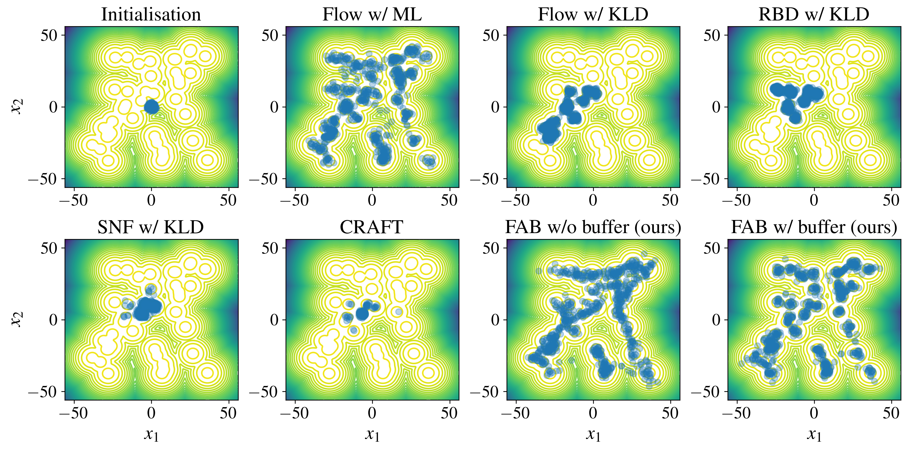

# Flow Annealed Importance Sampling Bootstrap (FAB)

## Overview

Normalizing flows can approximate complicated Boltzmann distributions of physical systems. However, 
current methods for training flows either suffer from mode-seeking behavior, use samples from the 
target generated beforehand by expensive MCMC simulations, or use stochastic losses that have very 
high variance. We tackle this challenge by augmenting flows with annealed importance sampling (AIS) 
and minimize the mass covering $\alpha$-divergence with $\alpha = 2$, which minimizes importance 
weight variance. Our method, Flow AIS Bootstrap (FAB), uses AIS to generate samples in regions 
where the flow is a poor approximation of the target, facilitating the discovery of new modes. 

In this repository, we implement FAB and provide the code to reproduce our experiments. For more
details about our method and the results of our experiments, please read
[our paper](https://arxiv.org/abs/2208.01893).

## Methods of Installation

The  package can be installed via pip by navigating in the repository directory and running

```
pip install --upgrade .
```

## Experiments

### Gaussian Mixture Model

<a href="https://colab.research.google.com/github/lollcat/fab-torch/blob/dev-loll/experiments/gmm/fab_gmm.ipynb" target="_parent"></a>

For this problem we use a mixture of 40 two dimensional Gaussian distributions. 
This allows for easy visualisation of the various methods for training the flow.
We provide a [colab notebook](experiments/gmm/fab_gmm.ipynb) with an example of training a flow on the GMM problem, 
comparing FAB to training a flow with KL divergence minimisation.

To run the experiment for the FAB with a prioritised replay buffer (for the first seed), use the following command:
```
python experiments/gmm/run.py training.use_buffer=True training.prioritised_buffer=True
```
To run the full set of experiments see the [README](experiments/gmm/README.md) for the GMM experiments. 

The below plot shows samples from various trained models, with the GMM problem target contours in the background.


### Many Well distribution
The Many Well distribution is made up of multiple repeats of the Double Well distribution, 
from the [original Boltzmann generators paper](https://www.science.org/doi/10.1126/science.aaw1147).

We provide a [colab notebook](experiments/many_well/fab_many_well.ipynb) comparing FAB to training a flow via KL divergence minimisation, on the 
6 dimensional Many Well problem, where the difference between the two methods is apparent after a 
short (<15 min) training period.

To run the experiment for the FAB with a prioritised replay buffer (for the first seed) on the 
32 dimensional Many Well problem, use the following command:
```
python experiments/many_well/run.py training.use_buffer=True training.prioritised_buffer=True
```
To run the full set of experiments see the [README](experiments/many_well/README.md) for the Many Well experiments. 

The below plot shows samples for our model (FAB) vs training a flow by reverse KL divergence 
minimisation, with the Many Well problem target contours in the background. 
This visualisation is for the marginal pairs of the distributions for the first four elements of the x.


### Alanine dipeptide

In our final experiment, we approximate the Boltzmann distribution of alanine dipeptide in an 
implicit solvent, which is a molecule with 22 atoms and a popular model system. The molecule
is visualized in the figure below. The right figure shows the probability density of for the
dihedral angle $\phi$ comparing the ground truth, which was obtrained with a molecular dynamics
(MD) simulation, the models trained with our method as well as maximum likelihood on MD samples.


Furthermore, we compared the Ramachandran plots of the different methods in the following figure.


To reproduce our experiment, use the [`experiments/aldp/train.py`](experiments/aldp/train.py) script.
The respective configuration files are located in [`experiments/aldp/config`](experiments/aldp/config).
We used the seeds 0, 1, and 2 in our runs.

The data used to evaluate our models and to train the flow model with maximum likelihood is provided 
on [Zenodo](https://zenodo.org/record/6993124#.YvpugVpBy5M).

[](https://doi.org/10.5281/zenodo.6993124)


### About the code 
The main FAB loss can be found in [core.py](fab/core.py), and we provide a simple training loop to 
train a flow with this loss (or other flow - loss combinations that meet the spec) in [train.py](fab/train.py) 
The FAB training algorithm **with** the prioritised buffer can be found in [train_with_prioritised_buffer.py](fab/train_with_prioritised_buffer.py). 

### Normalizing Flow Libraries
We offer a simple wrapper that allows for various normalising flow libraries to be plugged into 
this repository. The main library we rely on is 
[normflows](https://github.com/VincentStimper/normalizing-flows). 


## Citation

If you use this code in your research, please cite it as:

> Laurence I. Midgley, Vincent Stimper, Gregor N. C. Simm, Bernhard Schölkopf, José Miguel 
> Hernández-Lobato. Flow Annealed Importance Sampling Bootstrap. ArXiv, abs/2208.01893, 2022.

**Bibtex**

```
@article{Midgley2022,
  title={Flow {A}nnealed {I}mportance {S}ampling {B}ootstrap},
  author={Laurence I. Midgley and Vincent Stimper and Gregor N. C. Simm and Bernhard Sch\"olkopf and Jos{\'e} Miguel Hern{\'a}ndez-Lobato},
  journal={ArXiv},
  year={2022},
  volume={abs/2208.01893}
}
```

