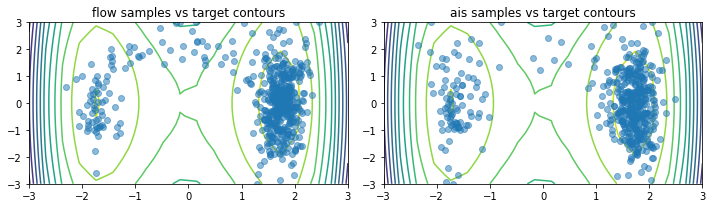
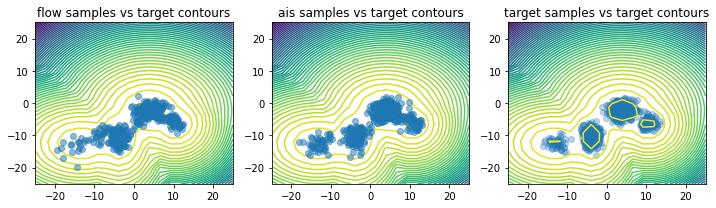

# Flow Annealed Importance Sampling Bootstrap (FAB)
See corresponding paper [here](https://arxiv.org/abs/2111.11510).

## Methods of Installation

The  package can be installed via pip by navigating in the repository directory and running

```
pip install --upgrade .
```

## Examples
For visualised examples of training a normalising flow model with FAB see:
 - Double Well Boltzmann distribution [notebook](examples/double_well.ipynb), a GMM 
target distribution [notebook](examples/gmm.ipynb) for simple 2D problems that can be run in a few
minutes locally. 
 - 16 dimensional Many Well Boltzmann distribution example 
   [colab notebook](https://github.com/lollcat/FAB-TORCH/blob/master/examples/many_well_16.ipynb) 
   for a more challenging target distribution (256 modes). We recommend running this with GPU 
   turned on.

**Double Well Boltzmann distribution samples vs contours**


**Gaussian Mixture Model samples vs contours**



## About the code 
The main FAB loss can be found in [core.py](fab/core.py), and we provide a simple training loop to 
train a flow with this loss (or other flow - loss combinations that meet the spec) in [train.py](fab/train.py) 


### Normalizing Flow Libraries
We offer a simple wrapper that allows for various normalising flow libraries to be plugged into 
this repository. The main library we rely on is 
[normflows](github.com/VincentStimper/normalizing-flows), however we also supply wrappers for 
[nflows](https://github.com/bayesiains/nflows) and flowtorch (TBD). 