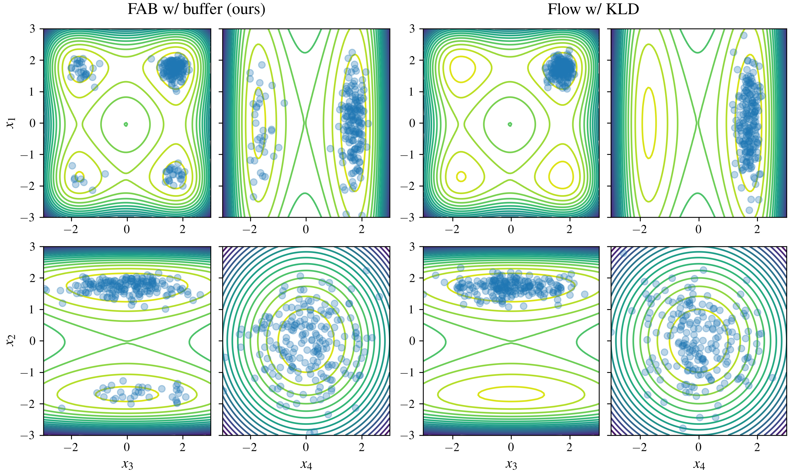
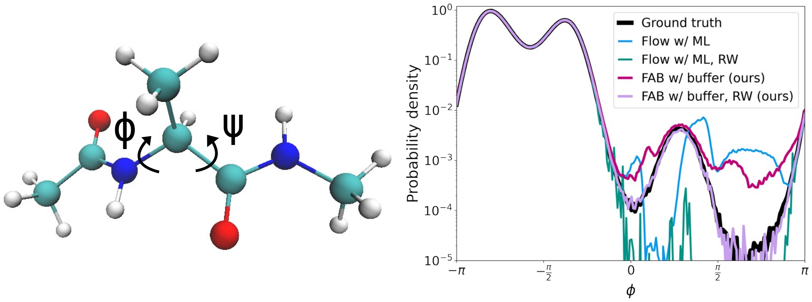

# Flow Annealed Importance Sampling Bootstrap (FAB)

## Methods of Installation

The  package can be installed via pip by navigating in the repository directory and running

```
pip install --upgrade .
```

## Experiments

### Gaussian Mixture Model
For this problem we use a mixture of 40 two dimensional Gaussian distributions. 
This allows for easy visualisation of the various methods for training the flow.

To run the experiment for the FAB with a prioritised replay buffer (for the first seed), use the following command:
```
python examples/gmm/run.py training.use_buffer=True training.prioritised_buffer=True
```
To run the full set of experiments see the [README](../examples/gmm/README.md) for the GMM experiments. 

The below plot shows samples from various trained models, with the GMM problem target contours in the background.


### Many Well distribution
The 32 Many Well distribution is made up of 16 repeats of the Double Well distribution, 
from the original Boltzmann generators [paper](https://www.science.org/doi/10.1126/science.aaw1147).

To run the experiment for the FAB with a prioritised replay buffer (for the first seed), use the following command:
```
python examples/many_well/run.py training.use_buffer=True training.prioritised_buffer=True
```
To run the full set of experiments see the [README](./examples/many_well/README.md) for the Many Well experiments. 

The below plot shows samples for our model (FAB) vs training a flow by reverse KL divergence 
minimisation, with the Many Well problem target contours in the background. 
This visualisation is for the marginal pairs of the distributions for the first four elements of the x.


### Alanine dipeptide

In our final experiment, we approximate the Boltzmann distribution of alanine dipeptide in an 
implicit solvent, which is a molecule with 22 atoms and a popular model system. The molecule
is visualized in the figure below. The right figure shows the probability density of for the
dihedral angle $\phi$ comparing the ground truth, which was obtrained with a molecular dynamics
(MD) simulation, the models trained with our method as well as maximum likelihood on MD samples.



Furthermore, we compared the Ramachandran plots of the different methods in the following figure.


To reproduce our experiment, use the [`examples/aldp/train.py`](examples/aldp/train.py) script.
The respective configuration files are located in [`examples/aldp/config`](examples/aldp/config).
We used the seeds 0, 1, and 2 in our runs.

## About the code 
The main FAB loss can be found in [core.py](fab/core.py), and we provide a simple training loop to 
train a flow with this loss (or other flow - loss combinations that meet the spec) in [train.py](fab/train.py) 
The FAB training algorithm **with** the prioritised buffer can be found in [train_with_prioritised_buffer.py](fab/train_with_prioritised_buffer.py). 


### Normalizing Flow Libraries
We offer a simple wrapper that allows for various normalising flow libraries to be plugged into 
this repository. The main library we rely on is 
[normflows](https://github.com/VincentStimper/normalizing-flows). 

