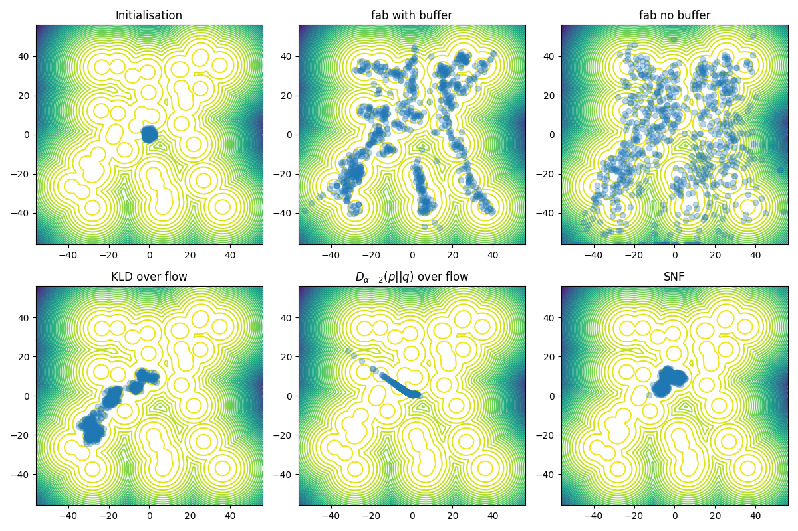
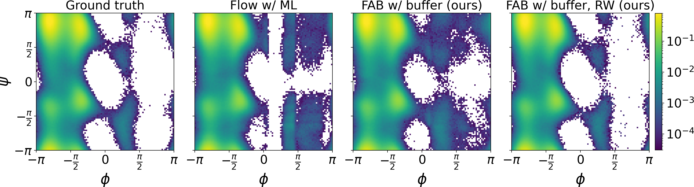

# Flow Annealed Importance Sampling Bootstrap (FAB)
See corresponding paper [here](https://arxiv.org/abs/2111.11510).

## Methods of Installation

The  package can be installed via pip by navigating in the repository directory and running

```
pip install --upgrade .
```

## Examples
For visualised examples of training a normalising flow model with FAB see:
 - Double Well Boltzmann distribution [notebook](examples/double_well.ipynb), a GMM 
target distribution [notebook](examples/gmm.ipynb) for simple 2D problems that can be run in a few
minutes locally. 
 - 16 dimensional Many Well Boltzmann distribution example 
   [colab notebook](https://github.com/lollcat/FAB-TORCH/blob/master/examples/many_well_16.ipynb) 
   for a more challenging target distribution (256 modes). We recommend running this with GPU 
   turned on.


**Gaussian Mixture Model samples vs contours**



## Experiments

### Alanine dipeptide

In our final experiment, we approximate the Boltzmann distribution of alanine dipeptide in an 
implicit solvent, which is a molecule with 22 atoms and a popular model system. The molecule
is visualized in the figure below. The right figure shows the probability density of for the
dihedral angle $\phi$ comparing the ground truth, which was obtrained with a molecular dynamics
(MD) simulation, the models trained with our method as well as maximum likelihood on MD samples.


Furthermore, we compared the Ramachandran plots of the different methods in the following figure.



To reproduce our experiment, use the [`examples/aldp/train.py`](examples/aldp/train.py) script.
The respective configuration files are located in [`examples/aldp/config`](examples/aldp/config).
We used the seeds 0, 1, and 2 in our runs.

## About the code 
The main FAB loss can be found in [core.py](fab/core.py), and we provide a simple training loop to 
train a flow with this loss (or other flow - loss combinations that meet the spec) in [train.py](fab/train.py) 


### Normalizing Flow Libraries
We offer a simple wrapper that allows for various normalising flow libraries to be plugged into 
this repository. The main library we rely on is 
[normflows](https://github.com/VincentStimper/normalizing-flows). 